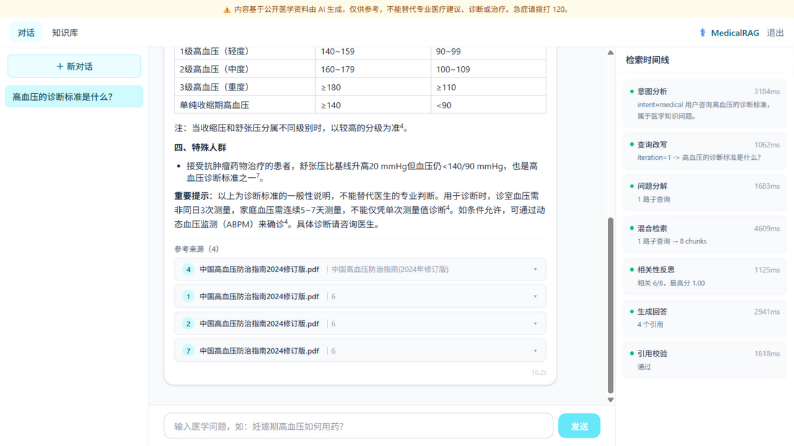
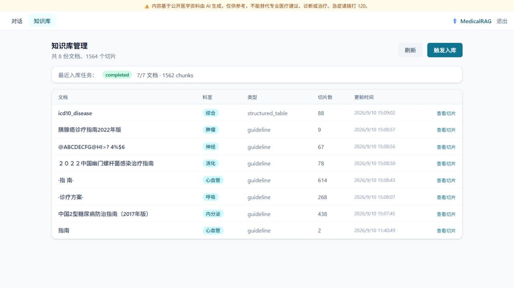

# MedicalRAG —— 医学知识检索与问答 Copilot

生产级中文医学 RAG 系统：多格式知识入库 → Milvus 混合检索（dense + BM25 + RRF）+ BGE 重排 → LangGraph Agentic 编排（查询改写 / 多跳分解 / 检索反思 / 引用校验 / 安全拒答）→ 流式引用回答，配套量化评估体系与一键部署。

## 项目状态

- [x] P1 基础设施与骨架（FastAPI / 配置分层 / 模型抽象层 / MySQL+Redis+Milvus / CI）
- [x] P2 数据与 Ingestion 管线（多格式解析 / 结构感知分块 / Milvus 混合索引 / 幂等入库 CLI）
- [x] P3 检索管线（双路召回 + 手写 RRF/加权融合 + BGE 重排 + 属性过滤 + 调试 CLI）
- [x] P4 Agentic 编排与生成（LangGraph：分析/改写/分解/反思/引用生成/忠实度校验/拒答）
- [x] P5 API 层（JWT / SSE 流式 / 多轮会话 / 知识库管理 / 后台入库）
- [x] P6 前端（React 对话 + 引用浮窗 + 检索时间线 + 知识库管理）
- [x] P7 评估体系（108 题测试集 + 三层指标 + 消融实验）
- [ ] P8 部署打磨（一键全栈）

路线图：`docs/superpowers/plans/2026-09-10-medicalrag-roadmap.md`；设计文档：`docs/superpowers/specs/`

## 快速开始（P1：基础设施 + API 骨架）

前置：Docker Desktop、uv、Python 3.12（uv 可自动安装）

```bash
cp .env.example .env      # 填入 LLM__API_KEY / EMBEDDING__API_KEY / RERANKER__API_KEY
make install              # 安装后端依赖（uv sync）
make infra-up             # 启动 Milvus + MySQL + Redis（首次拉镜像约数分钟）
make check-infra          # 连通性检查，期望三行 [ok]
cd backend && cp ../.env.example .env && uv run alembic upgrade head   # 建表
cd backend && uv run uvicorn app.main:app --reload --port 8000         # 启动 API
```

访问 `http://127.0.0.1:8000/docs` 查看 OpenAPI；`/api/v1/health` 返回三依赖探活。

端口说明：宿主端口使用 3307（MySQL）/ 6380（Redis）/ 19530、9091（Milvus）/ 9002（minio 控制台），避开本机已有服务。

切换 LLM：编辑 `.env` 的 `LLM__BASE_URL / LLM__MODEL / LLM__API_KEY`（例如 GLM：
`https://open.bigmodel.cn/api/paas/v4` + `glm-4-flash`），无需改代码。

## 知识入库（P2）

```bash
make ingest-samples                  # 入库内置样例（指南 md / 药品说明书 json / 医学页面 html）
make probe q="高血压的诊断标准"        # 检索冒烟：dense 与 BM25 各返回 top-3
make ingest                          # 入库 data/raw/ 下的真实语料（放置规范见 data/raw/README.md）
cd backend && uv run python -m app.ingestion --dir ../data/raw --dry-run   # 只解析分块统计
```

管线能力：PDF（字号聚类标题 / 双栏 / 表格）/ Markdown / HTML / DOCX / JSON 药品说明书 / CSV；
结构感知分块（可配置 structural/fixed/recursive，供评估消融）；Milvus 混合索引
（dense HNSW-COSINE + BM25 jieba + 科室/文档类型元数据过滤）；按文档 hash 幂等重插。

## 检索管线（P3）

```bash
make retrieve q="HbA1c 控制目标"                                    # 完整链路：双路召回→RRF融合→BGE重排
cd backend && uv run python -m app.rag --q "妊娠期高血压如何用药" --department 心血管   # 科室过滤
cd backend && uv run python -m app.rag --q "哮喘" --fusion weighted --no-rerank         # 切融合策略/关重排
```

两阶段检索：dense（BGE-M3 语义）+ BM25（jieba 精确术语）各召回 top-50 → 手写融合
（RRF / 加权可切换，消融变量）→ BGE-reranker-v2-m3 精排取 top-8；每阶段耗时记录；
`RetrievalResult` 含 dense/sparse/fused/rerank 四级分数，可完整追溯排序变化。

## Agentic 问答（P4）

```bash
make ask q="血压多高算是高血压？需要吃药吗"   # 完整 Agentic 链路 + 引用 + 执行时间线
```

LangGraph 状态机（每节点独立 Pydantic schema，可单测）：

```
analyze（意图/风险）─┬─ 风险/闲聊 → 安全回复
                    └─ 医学 → rewrite（指代消解/术语化）→ decompose（多跳拆解）
                              → retrieve（子查询并行）→ grade（Self-RAG 反思，低置信带反馈重写 ≤2 轮）
                              → generate（引用角标）→ verify（逐句忠实度校验，失败再生成 ≤1 次）
                              → fallback（证据不足诚实拒答 + 免责声明）
```

## HTTP API（P5）

```bash
cd backend && uv run uvicorn app.main:app --port 8000   # 启动 API（/docs 可交互调试）

# 认证
curl -X POST :8000/api/v1/auth/register -d '{"username":"u","password":"secret123"}'
curl -X POST :8000/api/v1/auth/login    -d '{"...":"..."}'          # → access_token

# 流式问答（SSE：step 节点事件 / token 增量 / done 引用汇总 / error）
curl -N -X POST :8000/api/v1/chat -H "Authorization: Bearer $TOKEN" \
     -d '{"query":"二甲双胍适合什么样的糖尿病人"}'
# 多轮：{"query":"它的剂量呢","conversation_id":1}（自动指代消解）

# 会话历史 / 知识库管理
GET /api/v1/conversations                # 会话列表
GET /api/v1/conversations/{id}/messages  # 消息历史（含引用）
GET /api/v1/documents                    # 文档清单 + 最近入库任务
GET /api/v1/documents/{hash}/chunks      # 文档 chunk 采样
POST /api/v1/admin/ingest                # 触发后台入库；GET 查任务状态
```

## Web 前端（P6）

```bash
# 终端 1：后端（8000 被占用时换端口并同步 API_TARGET）
cd backend && uv run uvicorn app.main:app --port 8000
# 终端 2：前端
cd frontend && npm run dev          # http://localhost:5173，/api 自动代理到后端
```

功能：注册/登录 → 流式对话（token 逐字渲染 + Markdown/表格）→ 行内引用角标点击定位
参考来源卡片（chunk 原文/来源/章节/页码）→ 右侧 **Agentic 检索时间线** 实时展示
意图分析→改写→分解→检索→反思→生成→校验每一步耗时与结论 → 多会话管理 →
知识库页（文档清单/chunk 采样/触发入库）。




生产镜像：`cd frontend && docker build -t medicalrag-frontend .`（nginx 托管 + `/api` 反代，SSE 无缓冲配置）。

## 评估体系（P7）

测试集 108 题（in-KB 60 由知识库反向 question-generation 生成 + 多跳 20 + 手写知识库外 20 + 急症 8），三层指标自动化评估：

| 消融配置 | Recall@5 | MRR | nDCG@5 |
|----------|----------|-----|--------|
| 纯 dense | 0.550 | 0.417 | 0.443 |
| + BM25 混合（RRF） | 0.500 | 0.439 | 0.439 |
| **+ BGE 重排** | **0.631** | **0.566** | **0.566** |

| Agentic 全链路 | 结果 | 目标 |
|----------------|------|------|
| 知识库外拒答率（防幻觉） | **100%** | ≥80% |
| 急症拦截率（医学安全） | **100%** | 100% |
| in-KB 正常回答率 | 75% | — |
| 忠实度 / 相关性（中文 LLM-as-Judge） | 0.833 / 0.833 | — |

两个值得讲的发现：① RRF 融合提升排序质量（MRR↑）但对口语化改写型查询的召回略降——**重排才是本场景最大收益项（Recall +8pp）**；② 严苛的检索反思+引用校验换来 100% 拒答率的同时，把 25% 的可答题也拒了（precision/recall 的权衡实证）。

复现：`cd backend && uv run python -m app.evaluation`（完整报告见 `evaluation/reports/`，测试集见 `evaluation/datasets/`）。

## 目录结构

```
backend/     FastAPI 后端（app/core 配置与模型抽象层、app/models、alembic）
frontend/    React 前端（P6）
data/        原始与处理后语料（不入库）
evaluation/  测试集与评估报告
deploy/      docker-compose（基础设施）
scripts/     运维脚本
docs/        设计文档与 ADR
```
