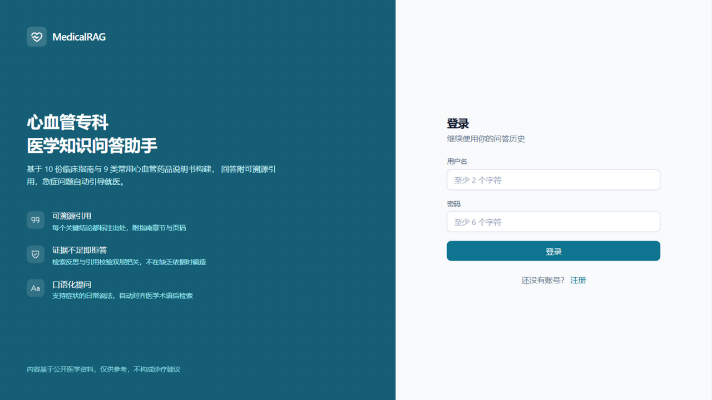

# MedicalRAG —— 医学知识检索与问答 Copilot

生产级**心血管专科**中文医学 RAG Copilot：多格式知识入库 → Milvus 混合检索（dense + BM25 + RRF）+ BGE 重排 → LangGraph Agentic 编排（查询改写 / 多跳分解 / 检索反思 / 引用校验 / 安全拒答）→ 流式引用回答，配套量化评估体系与一键部署。

```
┌─────────┐ SSE  ┌───────────────────── Backend · FastAPI (async) ─────────────────────┐
│ Frontend │ ──▶ │  API 层 ──▶ LangGraph Agentic 编排 ──▶ 检索管线 ──▶ 生成(流式+引用) │
│ React+TS │ ◀── │       (JWT/SSE/会话/知识库管理)                                    │
└─────────┘      └──────┬──────────┬──────────────┬──────────────┬───────────────────┘
                        ▼          ▼              ▼              ▼
                    MySQL 8     Redis 7      Milvus 2.5      云端 API
                   (对话/文档) (缓存/限流)  (dense+BM25混合)  (DeepSeek/GLM
                                                             +BGE Embed/Rerank)

┌─── Ingestion · 离线 CLI（幂等）───────────────────────────────────────────┐
│ PDF/MD/HTML/DOCX/JSON ─▶ 格式适配器 ─▶ 统一 Section 树 ─▶ 结构感知分块    │
│      ─▶ BGE-M3 向量化 ─▶ Milvus(dense+sparse+元数据) ─▶ MySQL 文档登记   │
└──────────────────────────────────────────────────────────────────────────┘
```

## 快速开始（Docker 全栈，5 步）

> 前置只要求两样：**Docker Desktop**（运行全部服务）和 **uv**（宿主机执行数据入库脚本，安装：`pip install uv` 或参照 [docs.astral.sh/uv](https://docs.astral.sh/uv/)）。前端在容器内构建，宿主机**不需要** Node。

**Step 1 — 配置 API Key**

```bash
cp .env.example .env
# 编辑 .env，填入 3 个 key（仓库根目录 .env 是全项目唯一配置源）：
#   LLM__API_KEY        DeepSeek（https://platform.deepseek.cn，充值 10 元足够）
#   EMBEDDING__API_KEY  SiliconFlow（https://cloud.siliconflow.cn，BGE-M3 免费）
#   RERANKER__API_KEY   同 SiliconFlow key
```

**Step 2 — 启动全部服务**

```bash
make up        # 首次拉镜像需几分钟；之后的启动只需数十秒
```

**Step 3 — 确认就绪**

```bash
make check-infra     # 期望输出三行 [ok]：mysql / redis / milvus
curl http://localhost:5182/api/v1/health
# 期望：{"status":"ok","checks":{"mysql":"ok","redis":"ok","milvus":"ok"}}
```

**Step 4 — 灌入知识库数据（关键，跳过此步提问会全部拒答）**

```bash
make ingest-samples   # 入库随仓库分发的 3 份样例（合成指南/药品说明书/医学页面）
# 或真实语料：data/raw/ 语料不随 git 分发，放置规范见 data/raw/README.md，然后：
# make ingest
```

**Step 5 — 打开浏览器提问**

访问 **http://localhost:5182** → 注册账号 → 提问（如"血压多高算是高血压？"）。
回答为流式输出，右侧时间线实时展示 Agentic 检索的每一步，关键结论附可点击的引用来源。

<details>
<summary><b>常见问题</b></summary>

- **提问全部返回"无法可靠回答"** → 知识库是空的，回看 Step 4 是否执行了 `make ingest-samples`
- **`make up` 后 api 容器一直重启** → 检查 `.env` 三个 key 是否已填写；`docker compose logs api` 看具体报错
- **端口冲突** → 宿主端口固定为 5182（前端）/ 8000（API）/ 3307（MySQL）/ 6380（Redis）/ 19530、9091（Milvus）/ 9002（minio），如被占用需修改 `docker-compose.yml` 端口映射
- **首次 embedding 很慢** → SiliconFlow 免费通道偶发排队，重试即可；重跑 `make ingest` 幂等不会产生重复数据

</details>

<details>
<summary><b>开发模式（前后端脱离 Docker 运行，改代码即时生效）</b></summary>

前置额外需要 Node 22；基础设施（Milvus/MySQL/Redis）仍用 Docker：

```bash
make install                        # 安装后端依赖（uv sync）
cd frontend && npm install && cd .. # 安装前端依赖
make infra-up && make check-infra   # 启动并检查基础设施
cd backend && uv run alembic upgrade head                        # 建表
cd backend && uv run uvicorn app.main:app --port 8100            # 终端 1：后端 API
cd frontend && API_TARGET=http://127.0.0.1:8100 npm run dev -- --port 5180   # 终端 2：前端
# 访问 http://localhost:5180
```

Windows 可双击 `start.bat`（等效上述开发模式 + 自动开浏览器；`stop.bat` 停止）。
生产镜像构建：`make build`（api 多阶段构建含自动建表；frontend 为 nginx 托管 + `/api` 反代）。
</details>

`http://localhost:8000/docs` 为 OpenAPI 交互文档；`/api/v1/health` 返回三依赖探活。

切换 LLM：编辑 `.env` 的 `LLM__BASE_URL / LLM__MODEL / LLM__API_KEY`（例如 GLM：
`https://open.bigmodel.cn/api/paas/v4` + `glm-4-flash`），无需改代码。

## 项目状态（全部完成）

- [x] P1 基础设施与骨架（FastAPI / 配置分层 / 模型抽象层 / MySQL+Redis+Milvus / CI）
- [x] P2 数据与 Ingestion 管线（多格式解析 / 结构感知分块 / Milvus 混合索引 / 幂等入库 CLI）
- [x] P3 检索管线（双路召回 + 手写 RRF/加权融合 + BGE 重排 + 属性过滤 + 调试 CLI）
- [x] P4 Agentic 编排与生成（LangGraph：分析/改写/分解/反思/引用生成/忠实度校验/拒答）
- [x] P5 API 层（JWT / SSE 流式 / 多轮会话 / 知识库管理 / 后台入库）
- [x] P6 前端（React 对话 + 引用浮窗 + 检索时间线 + 知识库管理）
- [x] P7 评估体系（108 题测试集 + 三层指标 + 消融实验）
- [x] P8 部署打磨（全栈 docker compose / CI 前后端 / ADR）

技术决策记录：[docs/adr/](docs/adr/README.md)；设计文档：`docs/superpowers/specs/`

## 知识入库（P2）

```bash
make ingest-samples                  # 入库内置样例（指南 md / 药品说明书 json / 医学页面 html）
make probe q="高血压的诊断标准"        # 检索冒烟：dense 与 BM25 各返回 top-3
make ingest                          # 入库 data/raw/ 下的真实语料（放置规范见 data/raw/README.md）
cd backend && uv run python -m app.ingestion --dir ../data/raw --dry-run   # 只解析分块统计
```

管线能力：PDF（字号聚类标题 / 双栏 / 表格）/ Markdown / HTML / DOCX / JSON 药品说明书 / CSV；
结构感知分块（可配置 structural/fixed/recursive，供评估消融）；Milvus 混合索引
（dense HNSW-COSINE + BM25 jieba + 科室/文档类型元数据过滤）；按文档 hash 幂等重插。

## 检索管线（P3）

```bash
make retrieve q="阿司匹林的禁忌"   # 完整链路：双路召回 → RRF 融合 → BGE 重排
cd backend && uv run python -m app.rag --q "妊娠期高血压如何用药" --department 心血管   # 科室过滤
cd backend && uv run python -m app.rag --q "哮喘" --fusion weighted --no-rerank        # 切融合策略/关重排
```

两阶段检索：dense（BGE-M3 语义）+ BM25（jieba 精确术语）各召回 top-50 → 手写融合
（RRF / 加权可切换，消融变量）→ BGE-reranker-v2-m3 精排取 top-8；每阶段耗时记录；
`RetrievalResult` 含 dense/sparse/fused/rerank 四级分数，可完整追溯排序变化。

## Agentic 问答（P4）

```bash
make ask q="血压多高算是高血压？需要吃药吗"   # 完整 Agentic 链路 + 引用 + 执行时间线
```

LangGraph 状态机（每节点独立 Pydantic schema，可单测）：

```
analyze（意图/风险）─┬─ 风险/闲聊 → 安全回复
                    └─ 医学 → rewrite（指代消解/术语化）→ decompose（多跳拆解）
                              → retrieve（子查询并行）→ grade（Self-RAG 反思，低置信带反馈重写 ≤2 轮）
                              → generate（引用角标）→ verify（逐句忠实度校验，失败再生成 ≤1 次）
                              → fallback（证据不足诚实拒答 + 免责声明）
```

## HTTP API（P5）

服务启动后（Docker 模式已在 `localhost:8000`，开发模式见 `http://localhost:8100/docs`）：

```bash
# 注册并登录（获取 token）
curl -X POST http://localhost:8000/api/v1/auth/register \
     -H "Content-Type: application/json" \
     -d '{"username":"demo","password":"secret123"}'
TOKEN=$(curl -s -X POST http://localhost:8000/api/v1/auth/login \
     -H "Content-Type: application/json" \
     -d '{"username":"demo","password":"secret123"}' | python -c "import sys,json;print(json.load(sys.stdin)['access_token'])")

# 流式问答（SSE：step 节点事件 / token 增量 / done 引用汇总 / error）
curl -N -X POST http://localhost:8000/api/v1/chat \
     -H "Content-Type: application/json" -H "Authorization: Bearer $TOKEN" \
     -d '{"query":"阿司匹林的禁忌是什么"}'
# 多轮：{"query":"它的用法用量呢","conversation_id":1}（自动指代消解）
```

其余端点：`GET /api/v1/conversations`（会话列表）、`GET /api/v1/conversations/{id}/messages`
（历史含引用）、`GET /api/v1/documents`（文档清单）、`POST /api/v1/admin/ingest`（触发后台入库）。
完整定义见 `/docs`（OpenAPI）。

## Web 前端（P6）

功能：注册/登录 → 流式对话（token 逐字渲染 + Markdown/表格）→ 行内引用角标点击定位
参考来源卡片（chunk 原文/来源/章节/页码）→ 右侧 **Agentic 检索时间线** 实时展示
意图分析→改写→分解→检索→反思→生成→校验每一步耗时与结论 → 多会话管理 →
知识库页（文档清单/chunk 采样/触发入库）。




## 评估体系（P7）

聚焦心血管专科语料（10 份指南全文 + 9 个药品说明书，2215 chunks），测试集 108 题
（in-KB 60 由知识库反向 question-generation 生成 + 多跳 20 + 手写知识库外 20 + 急症 8），
三层指标自动化评估：

| 检索消融（80 题） | Recall@5 | MRR | nDCG@5 |
|------------------|----------|-----|--------|
| 纯 dense | 0.569 | 0.534 | 0.526 |
| + BM25 混合（RRF） | 0.563 | 0.486 | 0.491 |
| **+ BGE 重排** | **0.625** | **0.613** | **0.589** |

| Agentic 全链路 | 结果 | 目标 |
|----------------|------|------|
| 知识库外拒答率（防幻觉） | **90%** | ≥80% |
| 急症拦截率（医学安全） | **100%** | 100% |
| in-KB 正常回答率 | 83.3% | — |
| 忠实度 / 相关性（中文 LLM-as-Judge） | **0.950 / 0.950** | — |

值得讲的三个发现：① 重排是本场景最大检索收益项（Recall +5.6pp、MRR +7.3pp），RRF 单独
收益有限且依赖查询分布；② 专科化后忠实度/相关性从 0.833 升至 0.950——语料厚度直接决定
生成质量上限；③ 拒答率 100%→90%：知识库变大让"拒绝"变难，90% 是更接近真实的防幻觉水位。

复现：`cd backend && uv run python -m app.evaluation`（报告见 `evaluation/reports/`，测试集见 `evaluation/datasets/`）。

## 目录结构

```
backend/     FastAPI 后端（app/core 配置与模型抽象层、app/rag 检索、app/agents 编排、app/ingestion、alembic）
frontend/    React 18 + TypeScript 前端
data/        语料目录（raw/ 真实语料与 samples/ 内置样例，均不入 git；raw_archive/ 已归档科室）
evaluation/  测试集（datasets/）与评估报告（reports/）
deploy/      开发用基础设施 compose（全栈 compose 在仓库根目录）
scripts/     运维脚本（连通性检查 / 测试集生成 / 指南抓取）
docs/        设计文档、ADR、简历项目描述
```
